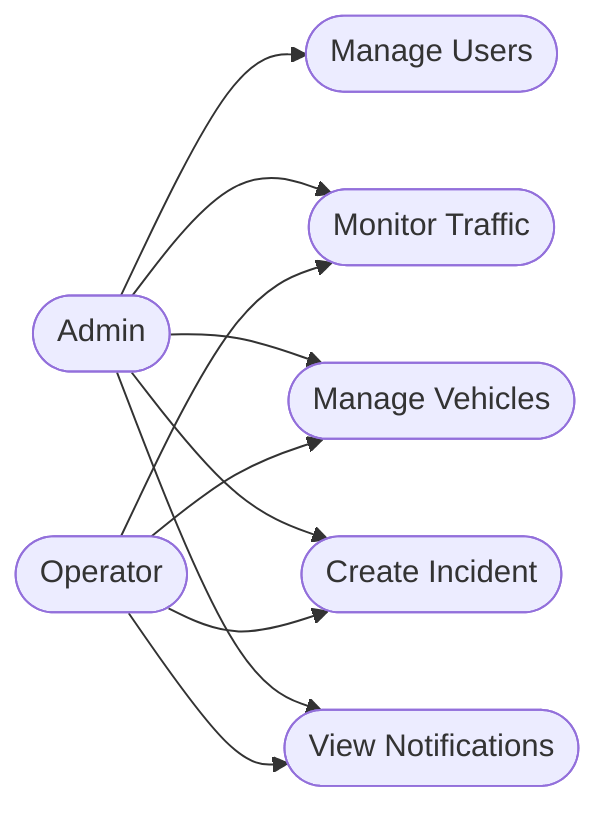
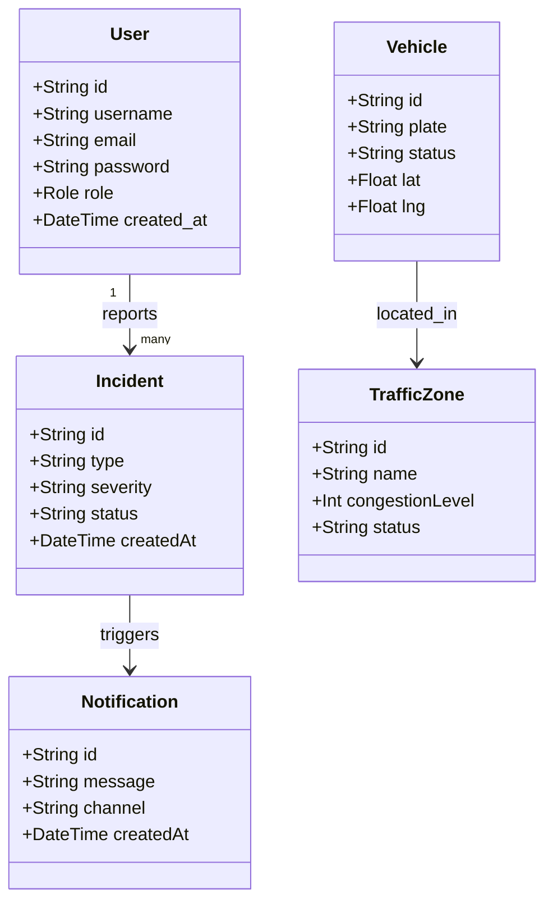
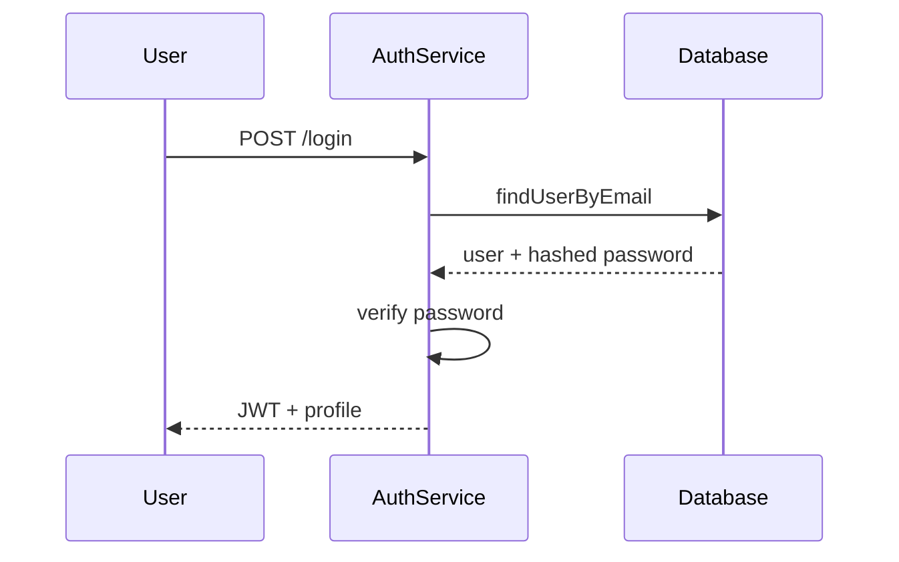
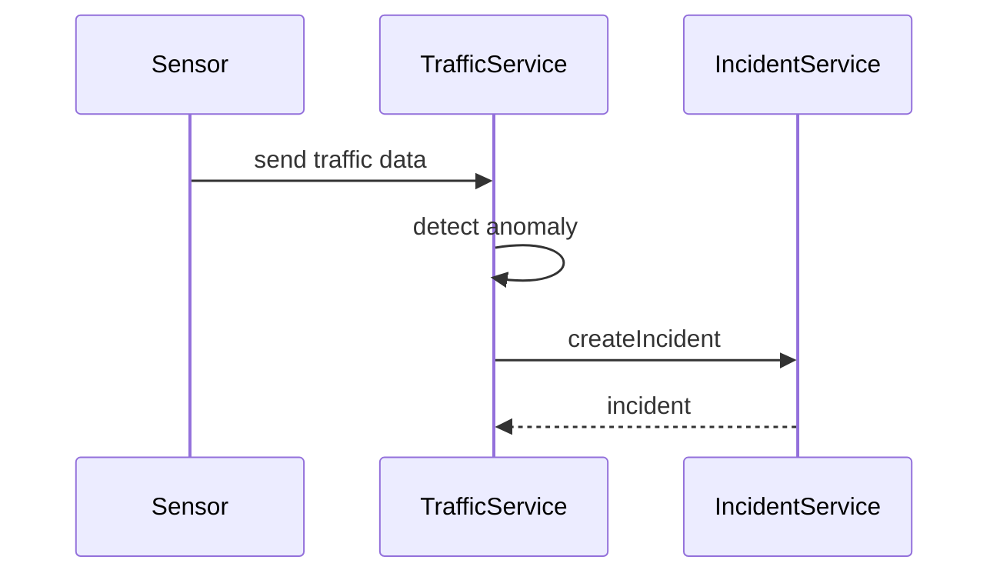
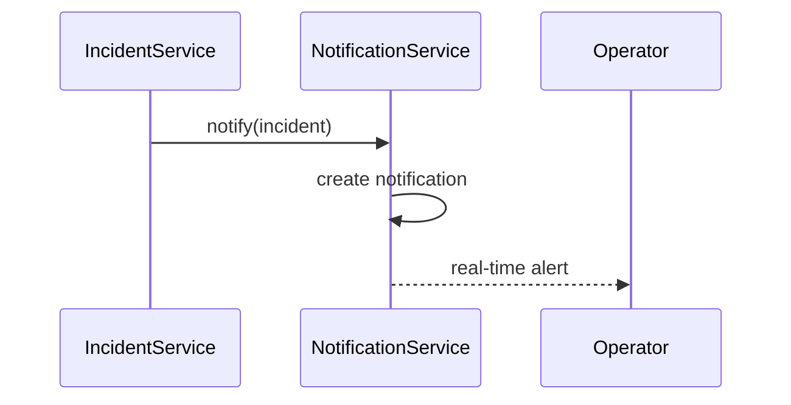
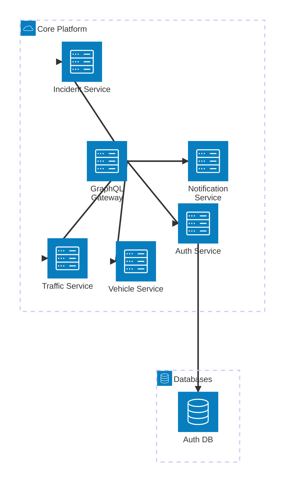

# UML Diagrams

## Use Case (Admin / Operator)

## Class Diagram

## Sequence Diagram - Login JWT

## Sequence Diagram - Detection Incident

## Sequence Diagram - Notification Automatique

## Architecture Diagram

